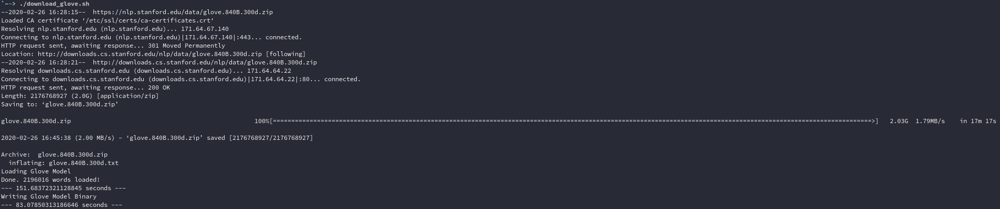
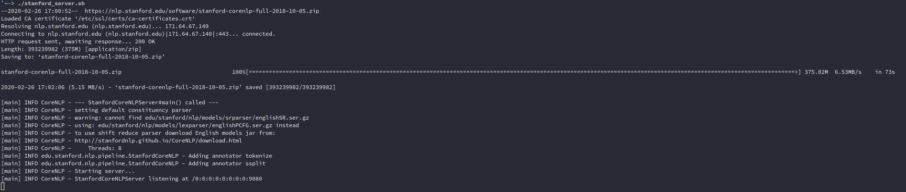
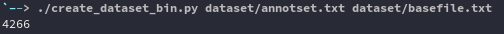
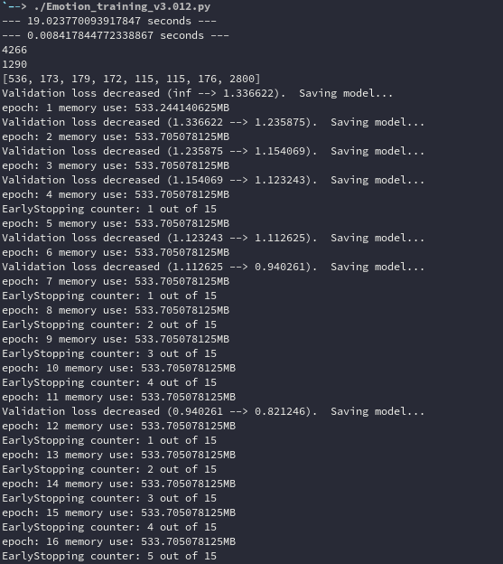
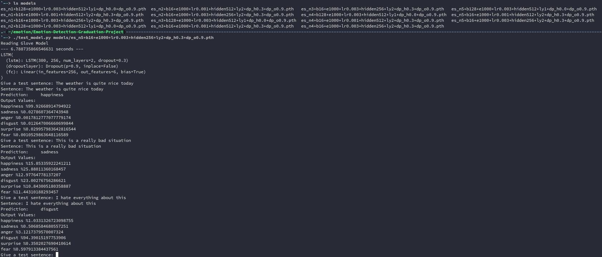

# Emotion Detection - Graduation Project
My graduation project from Dokuz Eylul University, 2019.

It uses GloVe word vectors, data from different places to train a model that can detect emotion in English sentences.

### Abstract
People convey different kinds of emotions in daily communication. These emotions can be transferred by writing, speech, and / or gestures. This project’s primary objective is to detect and classify the emotions in written messages correctly. Several natural language processing and deep learning methods have been used for this purpose. Six different emotions (happiness, sadness, anger, disgust, surprise, fear) have been chosen for the categorization or classification process of textual messages. GloVe word vectors are given as inputs to the LSTM (Long short-term memory) based deep learning model to classify the sentences. The benchmark datasets used in this project were obtained from two different resources via Internet. We used Python programming language and various libraries for the implementation of our project and some promising results have been obtained, which can be deduced slightly more successful than the relevant studies in the literature.

**Keywords**: Deep learning, emotion detection, LSTM, Word2Vec, multi-class classification

## Dependencies
* `jre-openjdk-headless`
* `python-pytorch-cuda`
* `python-nltk`
* `python-scikit-learn`
* `python-pandas`
* `python-matplotlib`

## Installation

> clone the repository and change directory
```shell
$ git clone https://github.com/Fethbita/Emotion-Detection-Graduation-Project.git
$ cd Emotion-Detection-Graduation-Project
```

> download and create a pickled glove file:
```shell
$ ./download_glove.sh
```


> download and run Stanford Core NLP Server in another terminal (downloads only once):
```shell
$ ./stanford_server.sh
```


> create your dataset with create_dataset_bin.py
> this requires 2 files, first file is the annotation file, annotation for each sentence on the corresponding line
> second file as the base file, one sentence per line:
> (annotation shortcuts can be changed by editing the script)
```shell
$ ./create_dataset_bin.py <annotation_filename> <data_filename>
```


> train a network, parameters can be found in the end of the file and in the beginning of the train function declaration
```shell
$ ./Emotion_training_v3.012.py
```


> test your network (Stanford Core NLP Server needs to be running):
```shell
$ ./test_model.py <trained_model_file.pth>
```

